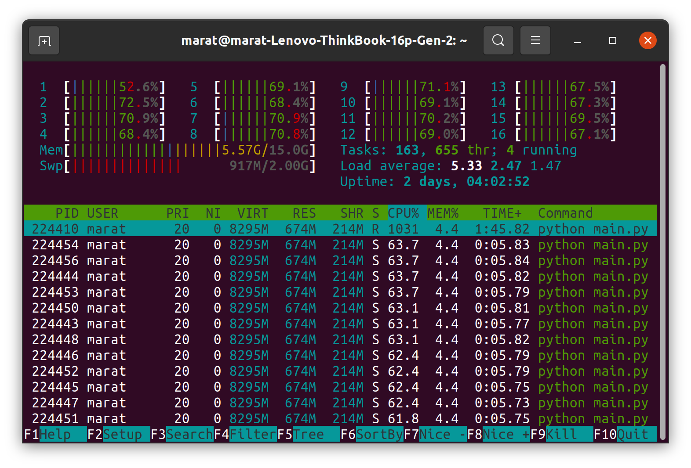

# Krolik
___Krolik___ - нейросетевой трекер.


## Установка
Установка зависимостей:
```
pip install -r requirements.txt
```
Далее, убедитесь что в [weights](weights) находится _onnx_ модели с соответствующими именами:
* [backbone.onnx](weights/backbone.onnx)
* [head.onnx](weights/head.onnx)

## Запуск

```
python main.py
```
Для указания дополнительных параметров используются следующие флаги:

* _--path_ - указание пути видеофайла;
* _--params_ - указание пути до yaml файла с параметрами инференса
* _--debug_ - вывод времени инференса для основных блоков;

## Время инференса
При использовании 16-ядерного _AMD Ryzen 7 5800H with Radeon Graphics @ 1.2 GHz_ для
входного тензора размера [1, 3, 128, 128] получено следующее время инференса:

| Имя блока                    | Время выполнения, сек   |
|------------------------------|-------------------------|
| Предобработка                | 0.0071909427642822266  |
| Получение фич*                | 0.002417325973510742    |
| Получение позиции            | 0.016773223876953125    |
| Постпроцессинг позиции       | 5.555152893066406e-05  |


Тем самым самый медленное время инференса занимает ~0.016 секунд, что равно ~62 кадрам в секунду.

*Получение фич происходит только на этапе инициализации

## Загруженность процессора CPU

Вывод загруженности процессора _AMD Ryzen 7 5800H with Radeon Graphics @ 1.2 GHz_ из _htop_:



